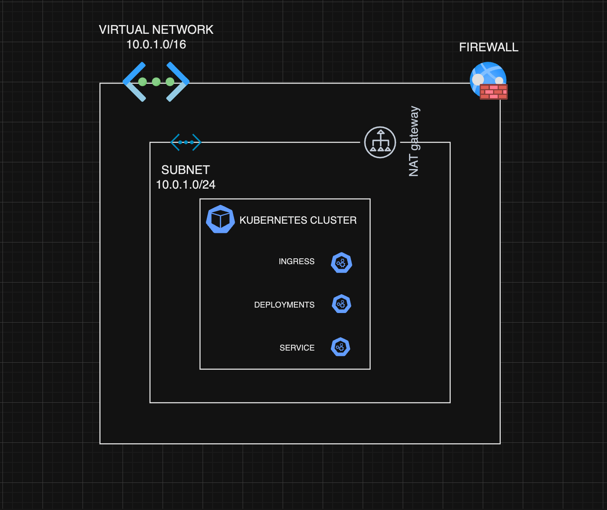

## Cetha - Automating the Deployment of a Simple Web API

### Overview
The 'Cetha' project involves building and deploying a simple API on a Kubernetes cluster. The entire process is fully automated using Infrastructure as Code to provision all necessary resources, including Kubernetes components.

_Architectural structure of the infrastructure:_
    

To complete the project, the following tools were used:
For this project I will be using:
- __NodeJS__ - Web api
- __Azure__ -  Cloud provider
- __Azure Kubernetes cluster__
- __Terraform__ - Infrastructure as Code
- __Azure blob storage__ - Terraform emote backend
- __Prometheus & Grafana__ - Monitoring
- __Github Actions - Continous__ Integration/Deployment

Terraform is ideal for setting up and managing the infrastructure for Kubernetes, particularly with services like AWS EKS. Kubernetes orchestrates and manages containerized applications, while Helm simplifies application deployment, updates, and management. By using Terraform's Helm provider, you can manage both infrastructure and application deployments within a single Terraform script, making it a core requirement for this task. Prometheus and Grafana are employed to observe the state of the cluster.
All resources are provisioned to AKS cluster on Azure.
Github actions to automate continous integration and delivery process.

The project folder has three major directories:
- `api` - the nodejs(express) api code and corresponding dockerfile
- `insfrastructure` - terraform configurations
- `k8s` - kubernetes manifests and the api app packaged in a helm-chart

### Deliverables

__The API:__
The [NodeJS application](./api/app.js) is a simple api that returns the current time when queried.

__Terraform:__
The [Terraform configuration](./infrastructure/) will:
- Deploy resources to Azure to create a Kubernetes cluster, Network, IAM roles and policies.
- Authenticate with the created cluster using Helm to install application chart, nginx ingress controller to route traffic to the cluster and prometheus stack that will handle monitoring in the cluster.

__CI/CD:__
The [GitHub Actions workflow](.github/workflows/pipeline.yaml) is designed to:
- __Build and Push Docker Image:__
On changes to the application code, It builds a Docker image from a Dockerfile located in the ./api directory and pushes the image to Docker Hub.
- __Update Helm Chart:__
It updates the image tag in the Helm chart to match the ID of the current GitHub Actions workflow run.
- __Deploy with Terraform:__
It deploys the updated Helm chart to a Kubernetes cluster using Terraform.
- __Test Deployment:__
It tests the deployed service by making an HTTP request to a specific endpoint.

__Running the application:__
To utilize this setup, there are things you need to have in place first:
- An azure subscription
- Terraform, Kubectl, AzCLI installed and configured
- An azure service principal
- A github account
- Basic knowledge of CLI, Git and Github

__Steps:__
- __Clone the repository__
```
git clone <repo-url>
cd <repo-url>
```
- __Test the api locally (optional)__
``` bash
cd api
npm install

# start the api server
node app.js

#output: api is listening at http://localhost:3000
```

- __Authenticate terraform with your azure account__
```bash
cd infrasctructure

# add env cariables
echo TF_VAR_client_id=<CLIENT_ID>
echo TF_VAR_client_secret=<CLIENT_SECRET>
echo TF_VAR_subscription_id=<SUBSCRIPTION_ID>
echo TF_VAR_tenant_id=<TENANT_ID>
```

Considering nature of the project, no external variables was needed. If yo want to customize any settting at this point, you should go through the code.

- __Set remote backend__
Azure blob storage was used as remote backend. Open the [providers.tf](./infrastructure/providers.tf) file and edit this block.
```
  backend "azurerm" {
    resource_group_name   = <resource-group>
    storage_account_name  = <stoarage-account>
    container_name        = <blob-container>
    key                   = "terraform.tfstate"
  }
```

- __Run the application__
```bash
terraform init

# if you made any changes to the code, you should verify
terrafrom validate

terraform plan
terraform apply -auto-approve
```

- __Test and explore__
After complete run, ther will be an output with the resource group and aks cluster created, retreive them.

```bash
# configure kubectl
az aks get-credentials --resource-group <resource-group> --name <aks-cluster> --overwrite-existing

# explore cluster
# see all running pods, services and deployments
kubectl get all -A

#inspect spplication resources
kubectl get all -n cetha

# inspect ingress/retreive ip address (useful for dns mapping)
kubectl get ingress -n cetha

# inspect the api on your local machine
kubectl port-forward -n cetha service/cetha-api 8080:80

```

- __Push to Github and Inspect workflow__
Push code to github, the workflow will trigger if there were any changes to the application code, infrastructure or kubernetes manifests. To successfully run the pipeline, you will need to update your repo with some required secrets. Get them and add to your github repo secrets. __Auth with Azure:__ - ARM_CLIENT_ID, ARM_CLIENT_SECRET, ARM_SUBSCRIPTION_ID, ARM_TENANT_ID, AZURE_CREDENTIALS. __Auth with dockerhub:__ - DOCKERHUB_TOKEN, DOCKER_USERNAME. __Auth with github:__ - TOKEN

After successful run, there are certain things that can be inspected to ensure pipeline ran properly.

_inspecting app pods_


_succesful pipeline run_


_updated tag_


_updated tag on dockerhub_


_text file with time endpoint was queried_

The endpoint_check.txt file uploaded as an artifact. It contains the result gotten when api is queried.

- __Possible Improvements:__
As with all software, there is always updates and patches, and this project is no different. There are certain areas that can be worked on:
    - TSL/SSL Certificates
    - Alerting using Prometheus/Alertmanager
    - Implement wider range of policies using open policy agent
